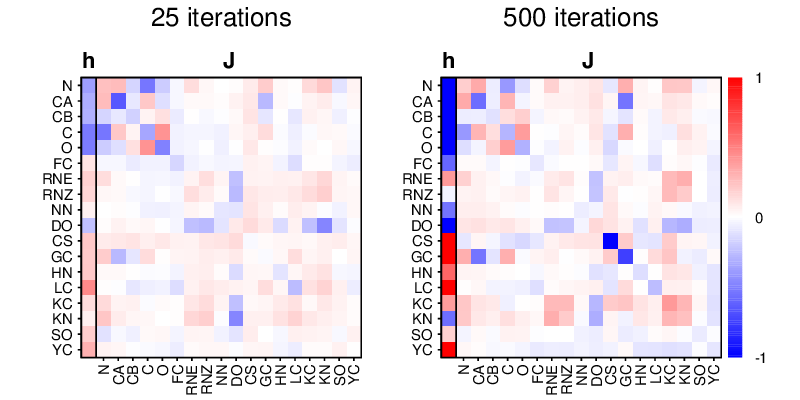

# ipot_solver
A program for solving the inverse Potts problem

## Installation

```
git clone https://github.com/gjoni/ipot_solver
cd ipot_solver
make
```

## Usage
```
Usage:   ./ipot_solver [-option] [argument]

Options:  -i input.txt                   - input, required
          -o output.txt                  - output, optional
          -c checkpoint.txt              - input/output, optional
          -n number of iterations          100
          -t number of threads             1
```

##### Example
Learn energies for the AACE18 statistical contact potential:
```
gunzip example/graph.txt.gz
./ipot_solver -i example/graph.txt -t 4 -n 20 -o table.out
```



## Links

 - [iPot](https://github.com/gjoni/iPot) statistical contact potential
 - [libLBFGS](https://github.com/chokkan/liblbfgs): a library of Limited-memory Broyden-Fletcher-Goldfarb-Shanno (L-BFGS)

## References
I Anishchenko, PJ Kundrotas, IA Vakser. Contact potential for structure prediction.
of proteins and protein complexes from Potts model. (2018).
[Biophys J. 115(5):809-21](https://doi.org/10.1016/j.bpj.2018.07.035)